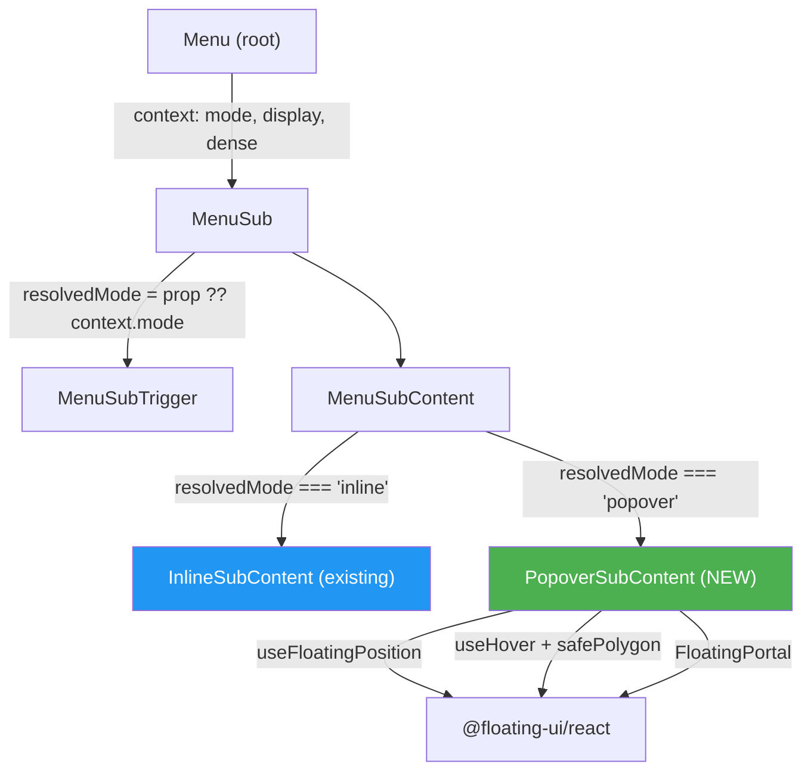

# Sub Flying (Popover) + display="icon" — Implementation Plan

Bổ sung **popover sub-menu (flyout)** và **display="icon"** mode cho `@thanh-libs/menu` v0.1.

## User Review Required

> [!NOTE]
> **✅ Confirmed:** Hook `useFloatingPosition` — giữ trong `@thanh-libs/dialog`, menu import trực tiếp.
> Menu thêm `@thanh-libs/dialog` + `@floating-ui/react` làm peerDependency.

> [!NOTE]
> **✅ Confirmed:** Keyboard navigation tối thiểu cho popover mode:
> - `ArrowRight` trên trigger → mở popover + focus first child
> - `ArrowLeft` / `Escape` trong popover → đóng + focus lại trigger

> [!IMPORTANT]
> **Popover trigger mode:** Ngoài hover (mặc định), có thêm **click-to-open** mode — popover chỉ mở khi bấm vào trigger, không tự mở khi hover.
>
> API: `<MenuSub mode="popover" trigger="click">` (default `trigger="hover"`).
> Prop `trigger` chỉ có ý nghĩa khi `mode="popover"`.

---

## Proposed Changes

### 1. Dependency — thêm `@thanh-libs/dialog` cho menu

#### [MODIFY] [package.json](file:///home/administrator/back%20up/Personal%20lib/libs/menu/package.json)

- Thêm `"@thanh-libs/dialog": "*"` vào `peerDependencies` và `devDependencies`
- Lý do: import `useFloatingPosition` + `FloatingPortal` + interaction hooks từ `@floating-ui/react`
- Cũng cần thêm `"@floating-ui/react": ">=0.27.0"` vào peer/dev vì menu dùng trực tiếp `useHover`, `useDismiss`, etc.

---

### 2. Models — thêm `mode` và `display` types

#### [MODIFY] [models/index.ts](file:///home/administrator/back%20up/Personal%20lib/libs/menu/src/lib/models/index.ts)

```ts
/** Sub-menu display mode */
export type MenuSubMode = 'inline' | 'popover';

/** Menu display mode */  
export type MenuDisplay = 'default' | 'icon';

/** Popover sub-menu trigger type */
export type MenuSubTriggerType = 'hover' | 'click';

// MenuProps — thêm:
mode?: MenuSubMode;       // default 'inline' — set default cho tất cả MenuSub
display?: MenuDisplay;    // default 'default' — 'icon' = icon-only mode

// MenuSubProps — thêm:
mode?: MenuSubMode;       // override parent setting, priority con > cha
trigger?: MenuSubTriggerType; // default 'hover' — chỉ cho popover mode, 'click' = bấm mới mở

// MenuSubContentProps — thêm (chỉ cho popover mode):
placement?: Placement; // default 'right-start'
offset?: number;       // default 4
```

---

### 3. Context — truyền `mode` + `display` xuống

#### [MODIFY] [useMenuContext.ts](file:///home/administrator/back%20up/Personal%20lib/libs/menu/src/lib/hooks/useMenuContext.ts)

```ts
export interface MenuContextValue {
  dense: boolean;
  mode: MenuSubMode;             // NEW — default sub-menu mode
  display: MenuDisplay;          // NEW — icon-only mode
  trigger: MenuSubTriggerType;   // NEW — default popover trigger type
}
```

#### [MODIFY] [Menu.tsx](file:///home/administrator/back%20up/Personal%20lib/libs/menu/src/lib/components/Menu.tsx)

- Nhận `mode` và `display` props
- Pass vào `MenuContext.Provider`

#### [MODIFY] [MenuSub.tsx](file:///home/administrator/back%20up/Personal%20lib/libs/menu/src/lib/components/MenuSub.tsx)

- Nhận `mode` prop (optional)
- Nhận `trigger` prop (optional, default `'hover'`)
- Đọc `mode` từ `MenuContext` nếu không set → priority: `MenuSub.mode > Menu.mode > 'inline'`
- Expose `resolvedMode` + `resolvedTrigger` qua `MenuSubContext`

---

### 4. Tách MenuSubContent thành 2 component internal

#### [MODIFY] [MenuSubContent.tsx](file:///home/administrator/back%20up/Personal%20lib/libs/menu/src/lib/components/MenuSubContent.tsx)

Branch component dựa trên `resolvedMode`:

```tsx
export const MenuSubContent = forwardRef((props, ref) => {
  const { resolvedMode } = useMenuSubContext();
  
  if (resolvedMode === 'popover') {
    return <PopoverSubContent ref={ref} {...props} />;
  }
  return <InlineSubContent ref={ref} {...props} />;
});
```

#### [NEW] [InlineSubContent.tsx](file:///home/administrator/back%20up/Personal%20lib/libs/menu/src/lib/components/InlineSubContent.tsx)

- Extract logic hiện tại từ `MenuSubContent` — giữ nguyên behavior
- `InlineSubContentStyled` + `data-collapsed` + ArrowLeft/Escape handler

#### [NEW] [PopoverSubContent.tsx](file:///home/administrator/back%20up/Personal%20lib/libs/menu/src/lib/components/PopoverSubContent.tsx)

- Dùng `useFloatingPosition` từ `@thanh-libs/dialog`
- Dùng `useHover` + `useClick` + `useDismiss` + `useRole` + `useInteractions` từ `@floating-ui/react`
- `FloatingPortal` wrapping
- `safePolygon()` — để hover safe zone giữa trigger và floating (giống Tooltip)
- Default placement: `'right-start'`
- **Trigger mode:**
  - `trigger='hover'` (default): `useHover` với `delay: { open: SUB_OPEN_DELAY, close: SUB_CLOSE_DELAY }` + `safePolygon()`
  - `trigger='click'`: `useClick` — chỉ mở khi bấm, không tự mở khi hover
- Keyboard tối thiểu (cả 2 trigger mode):
  - `ArrowRight` trên trigger → open + focus first child
  - `ArrowLeft` / `Escape` trong content → close + focus trigger
- Styled: `PopoverSubContentStyled` — menu-like panel (bg, border, shadow, border-radius)

---

### 5. MenuSubTrigger — hỗ trợ 2 mode

#### [MODIFY] [MenuSubTrigger.tsx](file:///home/administrator/back%20up/Personal%20lib/libs/menu/src/lib/components/MenuSubTrigger.tsx)

- Đọc `resolvedMode` từ `MenuSubContext`
- **Arrow indicator:**
  - `inline` → `▾` / `▴` (giữ nguyên)
  - `popover` → `▸` (luôn hiện)
- **Popover mode:** cần set `ref` cho `useFloatingPosition` reference element
  - Approach: `MenuSubContext` expose `setReference` (từ `useFloatingPosition`) → trigger dùng nó
- **Keyboard (popover mode):**
  - `ArrowRight` → open popover nếu chưa mở → focus first child sau delay
  - `Enter` / `Space` → toggle popover (giống click)

---

### 6. MenuSub — manage floating state cho popover mode

#### [MODIFY] [MenuSub.tsx](file:///home/administrator/back%20up/Personal%20lib/libs/menu/src/lib/components/MenuSub.tsx)

Khi `resolvedMode === 'popover'`:
- Gọi `useFloatingPosition` + interaction hooks
- Expose `setReference`, `setFloating`, `floatingStyles`, `getFloatingProps`, `getReferenceProps` qua context
- Toggle logic thay đổi: `open/close` controlled bởi floating-ui interactions (hover)

Khi `resolvedMode === 'inline'`:
- Giữ nguyên behavior hiện tại

---

### 7. Styled — thêm PopoverSubContentStyled

#### [MODIFY] [styled.tsx](file:///home/administrator/back%20up/Personal%20lib/libs/menu/src/lib/styled.tsx)

```ts
export const PopoverSubContentStyled = styled.div((): CSSObject => {
  const { palette, spacing }: ThemeSchema = useTheme();
  return {
    display: 'flex',
    flexDirection: 'column',
    backgroundColor: palette?.background?.paper ?? '#fff',
    border: `1px solid ${palette?.divider ?? 'rgba(0,0,0,0.12)'}`,
    borderRadius: BORDER_RADIUS,
    boxShadow: '0 4px 16px rgba(0,0,0,0.12)',
    padding: `${spacing?.tiny ?? '0.25rem'} 0`,
    minWidth: '160px',
    color: palette?.text?.primary ?? 'rgba(0,0,0,0.87)',
  };
});
```

---

### 8. display="icon" mode

#### [MODIFY] [MenuItem.tsx](file:///home/administrator/back%20up/Personal%20lib/libs/menu/src/lib/components/MenuItem.tsx)

Khi `display === 'icon'` (đọc từ context):
- Ẩn label text, chỉ show icon
- Khi hover → show Tooltip / popover hiển thị children text (display name)
- Icon container center aligned

#### [MODIFY] [MenuSubTrigger.tsx](file:///home/administrator/back%20up/Personal%20lib/libs/menu/src/lib/components/MenuSubTrigger.tsx)

Khi `display === 'icon'`:
- Ẩn label text, chỉ show icon
- Click/hover → mở popover sub-menu content (force `popover` mode)

#### [MODIFY] [styled.tsx](file:///home/administrator/back%20up/Personal%20lib/libs/menu/src/lib/styled.tsx)

- Thêm variant styles cho icon-only mode: narrower width, centered icon, hide label

---

### 9. Constants

#### [MODIFY] [constants/index.ts](file:///home/administrator/back%20up/Personal%20lib/libs/menu/src/lib/constants/index.ts)

```ts
/** Hover open delay for popover sub-menu (ms) */
export const SUB_OPEN_DELAY = 150;  // đã có, bây giờ sẽ được dùng

/** Close delay for popover sub-menu (ms) */
export const SUB_CLOSE_DELAY = 150;  // NEW

/** Min width for popover sub-menu content (px) */
export const POPOVER_MIN_WIDTH = 160;  // NEW

/** Z-index for popover sub-menu */
export const POPOVER_Z_INDEX = 1300;  // NEW
```

---

### 10. Tests

#### [MODIFY] [MenuSub.spec.tsx](file:///home/administrator/back%20up/Personal%20lib/libs/menu/tests/MenuSub.spec.tsx)

Thêm test cases:
- **Popover mode:** render trigger → hover → popover visible
- **Popover mode keyboard:** ArrowRight opens → ArrowLeft closes
- **Mode inheritance:** Menu `mode="popover"` → child MenuSub inherits
- **Mode override:** Menu `mode="inline"` → child `MenuSub mode="popover"` → popover

#### [NEW] [MenuDisplayIcon.spec.tsx](file:///home/administrator/back%20up/Personal%20lib/libs/menu/tests/MenuDisplayIcon.spec.tsx)

- Icon-only rendering: label hidden
- Hover shows tooltip/popover với display name

---

### 11. Exports

#### [MODIFY] [index.ts](file:///home/administrator/back%20up/Personal%20lib/libs/menu/src/index.ts)

Thêm export type `MenuSubMode`, `MenuDisplay`, `MenuSubTriggerType`.

---

### 12. Doc update

#### [MODIFY] [menu-analysis.md](file:///home/administrator/back%20up/Personal%20lib/plan/menu-analysis.md)

- Cập nhật Section 11 nhật ký: ghi đã implement popover sub-menu + display="icon"
- Cập nhật v0.1 checklist: mark popover mode + display="icon" = done
- Ghi lại `trigger` prop cho popover mode

---

## Architecture Diagram



---

## Open Questions (Remaining)

> [!WARNING]
> 1. **display="icon" — tooltip hay popover?** Khi `display="icon"` và item KHÔNG có sub-menu, hover hiện gì?
>    - **Option A:** Tooltip thuần (chỉ text, non-interactive) — dùng `@thanh-libs/dialog` Tooltip
>    - **Option B:** Mini popover (interactive, clickable) — phức tạp hơn
>    - **Recommendation:** Option A (Tooltip) cho MenuItem, Option B (Popover) cho MenuSubTrigger

> [!IMPORTANT]
> 2. **Popover dismiss behavior:** Khi user click item trong popover sub-menu → popover tự đóng? Hay giữ mở cho đến khi mouse leave?
>    - Context menu style → đóng khi click item
>    - Navigation menu style → có thể giữ mở
>    - **Recommendation:** Đóng khi click item (standard menu behavior)

---

## Verification Plan

### Automated Tests

```bash
cd "/home/administrator/back up/Personal lib/libs/menu" && npx vitest run
```

- Existing tests phải pass (inline mode không bị break)
- New popover mode tests
- New display="icon" tests

### Manual Verification (Storybook)

1. **Story: Popover Sub-menu** — hover trigger → flyout panel xuất hiện bên phải → hover vào panel → items clickable
2. **Story: Mixed mode** — Menu có cả inline + popover sub-menus
3. **Story: Icon-only** — `display="icon"` → chỉ icon hiện → hover show tooltip/popover
4. **Story: Mode inheritance** — `<Menu mode="popover">` → all subs flyout

