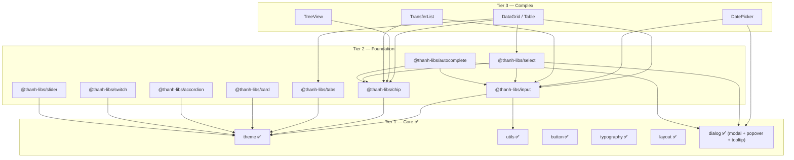

# @thanh-libs — Component Tier Roadmap

## Tầm nhìn tổng thể



---

## Tier 1 — Core ✅

| Lib | Version | Mô tả |
|-----|---------|-------|
| `theme` | v0.0.4 | Design tokens, ThemeProvider, palettes |
| `utils` | v0.0.6 | Pure TS utilities |
| `button` | v0.0.4 | Button component |
| `typography` | v0.0.3 | Text components |
| `layout` | v0.0.3 | Layout primitives |
| `dialog` | v0.0.1 | Modal, Popover, Tooltip |

---

## Tier 2 — Foundation (9 libs)

### 1. `@thanh-libs/input`

Theo pattern **MUI InputBase**: tạo base input → các variant extends từ base.

```
src/lib/
├── InputBase/           ← Low-level base (style reset, state logic)
├── TextField/           ← InputBase + label + helper text + adornments
├── Checkbox/            ← Checkbox + CheckboxGroup
├── Radio/               ← Radio + RadioGroup
├── shared/              ← FormControl, FormLabel, FormHelperText, InputAdornment
└── index.ts
```

| Component | Props chính |
|-----------|-----|
| **InputBase** | `value`, `onChange`, `disabled`, `readOnly`, `placeholder`, `type`, `startAdornment`, `endAdornment`, `error`, `inputRef` |
| **TextField** | Extends InputBase + `label`, `helperText`, `error`, `required`, `variant` (outlined/filled), `multiline`, `rows`, `fullWidth` |
| **Checkbox** | `checked`, `onChange`, `disabled`, `indeterminate`, `label` |
| **CheckboxGroup** | `options`, `value`, `onChange`, `direction` (row/column) |
| **Radio** | `checked`, `onChange`, `disabled`, `label` |
| **RadioGroup** | `options`, `value`, `onChange`, `direction` |

**Phụ thuộc:** `theme`, `utils`

---

### 2. `@thanh-libs/select`

Dùng **Popover** từ `dialog` cho dropdown. Có **single** và **multi** mode.

| Feature | MUI | AntD | Thanh-libs |
|---------|-----|------|-----------|
| Single select | ✅ | ✅ | ✅ |
| Multi select | ✅ | ✅ `mode="multiple"` | ✅ `mode="multiple"` |
| Multi → render chips | ✅ Chip | ✅ Tag | ✅ **Chip** (peer dep) |
| Search/filter | ❌ | ✅ `showSearch` | ✅ `showSearch` |
| Option groups | ✅ | ✅ `OptGroup` | ✅ `OptionGroup` |
| Clear button | ✅ | ✅ `allowClear` | ✅ `allowClear` |

**Phụ thuộc:** `input` (InputBase), `dialog` (Popover), `chip` (multi-select render)

---

### 3. `@thanh-libs/autocomplete`

Input với **suggestions**. Cho phép nhập tự do, hỗ trợ async.

| Feature | MUI | AntD | Thanh-libs |
|---------|-----|------|-----------|
| Single / Multi | ✅ | ✅ (single only) | ✅ cả hai |
| Multi → chips | ✅ | — | ✅ **Chip** |
| Free typing | ✅ `freeSolo` | ✅ (default) | ✅ `freeSolo` |
| Async options | ✅ `loading` | ✅ | ✅ `loading` + `onSearch` |
| Filter client | ✅ `filterOptions` | ✅ `filterOption` | ✅ `filterOptions` |
| Group / Custom render | ✅ | ✅ | ✅ |

**Phụ thuộc:** `input` (TextField), `dialog` (Popover), `chip` (multi render)

---

### 4. `@thanh-libs/chip`

Tags, badges, filter chips.

| Component | Props chính |
|-----------|-----|
| **Chip** | `label`, `variant` (filled/outlined), `color`, `size`, `onDelete`, `icon`, `avatar`, `clickable`, `disabled` |
| **ChipGroup** | `children`, `spacing`, `direction` |

**Phụ thuộc:** `theme`

---

### 5. `@thanh-libs/tabs`

| Component | Props chính |
|-----------|-----|
| **Tabs** | `value`, `onChange`, `variant` (default/contained), `orientation` |
| **Tab** | `label`, `value`, `icon`, `disabled` |
| **TabPanel** | `value`, `children` |

**Phụ thuộc:** `theme`

---

### 6. `@thanh-libs/card`

| Sub-component | Mô tả |
|---------------|-------|
| **Card** | Main container, `variant` (elevated/outlined), `hoverable` |
| **CardHeader** | Title + subtitle + avatar + action |
| **CardContent** | Body content |
| **CardMedia** | Cover image/video |
| **CardActions** | Footer buttons |

**Phụ thuộc:** `theme`

---

### 7. `@thanh-libs/accordion`

Collapsible panels (MUI: Accordion, AntD: Collapse).

| Sub-component | Mô tả |
|---------------|-------|
| **Accordion** | Single collapsible panel |
| **AccordionSummary** | Click trigger (header) |
| **AccordionDetails** | Collapsible content |
| **AccordionGroup** | Multiple panels, `exclusive` mode (1 at a time) |

**Phụ thuộc:** `theme`

---

### 8. `@thanh-libs/switch`

Toggle on/off.

| Component | Props chính |
|-----------|-----|
| **Switch** | `checked`, `onChange`, `disabled`, `size`, `label`, `color` |

**Phụ thuộc:** `theme`

---

### 9. `@thanh-libs/slider`

Range / value slider.

| Component | Props chính |
|-----------|-----|
| **Slider** | `value`, `onChange`, `min`, `max`, `step`, `marks`, `disabled`, `orientation`, `range` (dual thumb) |

**Phụ thuộc:** `theme`

---

## Tier 3 — Complex (tương lai)

| Component | Cần Foundation nào | Mô tả |
|---|---|---|
| **DataGrid / Table** | input, select, chip, tabs | Sortable, filterable, editable data table |
| **TreeView** | chip | Hierarchical tree với expand/collapse |
| **DatePicker** | input, dialog | Calendar picker |
| **TransferList** | input, chip | Dual-list transfer |

---

## Thứ tự build đề xuất

| # | Lib | Lý do |
|---|-----|-------|
| 1 | **chip** | Không phụ thuộc Foundation nào, cần cho select/autocomplete |
| 2 | **switch** | Độc lập, đơn giản |
| 3 | **slider** | Độc lập |
| 4 | **card** | Độc lập, dùng được ngay |
| 5 | **accordion** | Độc lập |
| 6 | **tabs** | Độc lập |
| 7 | **input** | Cần cho select/autocomplete |
| 8 | **select** | Phụ thuộc input + chip + dialog |
| 9 | **autocomplete** | Phụ thuộc input + chip + dialog, phức tạp nhất |
